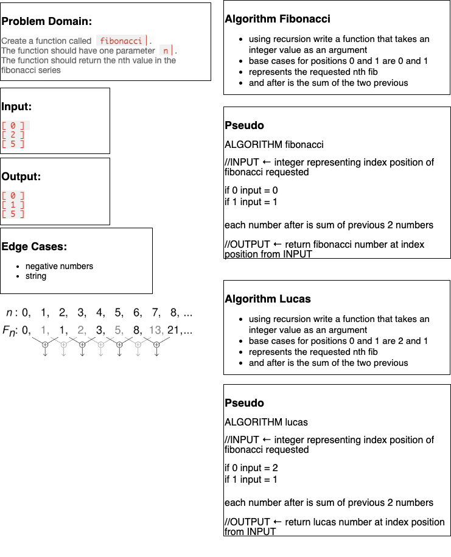

# Math-Series

_Author: Matthew Santorsola_

---

### Problem Domain

Create a function called `fibonacci`. The function should have one parameter `n`. The function should return the nth value in the fibonacci series. You may implement the function using recursion or iteration.

In your `series.py` module, add a new function `lucas` that returns the nth value in the lucas numbers

Add a third function called `sum_series` with one required parameter and two optional parameters. The required parameter will determine which element in the series to print. The two optional parameters will have default values of 0 and 1 and will determine the first two values for the series to be produced.

Calling this function with no optional parameters will produce numbers from the fibonacci series. Calling it with the optional arguments 2 and 1 will produce values from the lucas numbers. Other values for the optional parameters will produce other series.

## Approach & Efficiency

For the fibonacci and lucas numbers, I used a recursive function creating a call stack adding values as they are called.

The returned value represents the nth value at that index position of both fibonacci and lucas numbers.

Continue to work on sum of series

---

### Inputs and Expected Outputs

| Input     | Expected Output |
| :-------- | :-------------- |
| F [0,2,5] | [0,1,5]         |
| L [0,2,5] | [2,3,7]         |

---

### Big O

| Time | Space |
| :--- | :---- |
| O(n) | O(n)  |

---

### Whiteboard Visual

---

### Change Log

1.0: _intitial commit_ - 10 June 21
